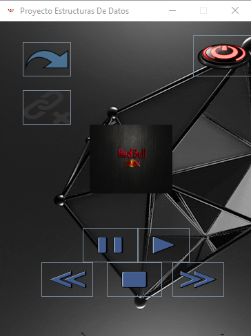
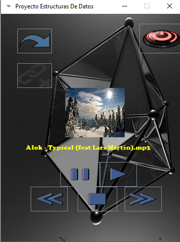
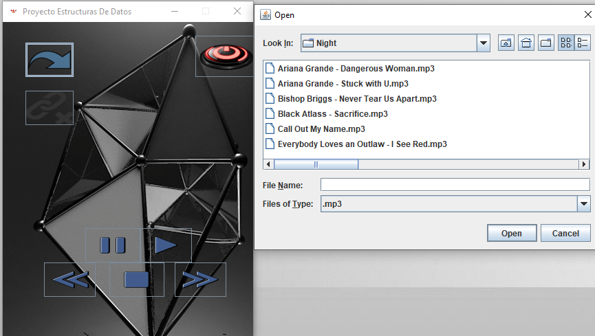

# Estructuras-de-datos-Reproductor-de-Musica-
## Usando Cola Circular

Lenguaje: Java

En el presente proyecto, se realizo un reproductor multimedia con la intencion de utilizar correctamente una Cola Circular de tal forma de poner a prueba las Estructuras de datos.

## Reproductor

## Carga de Archivos

